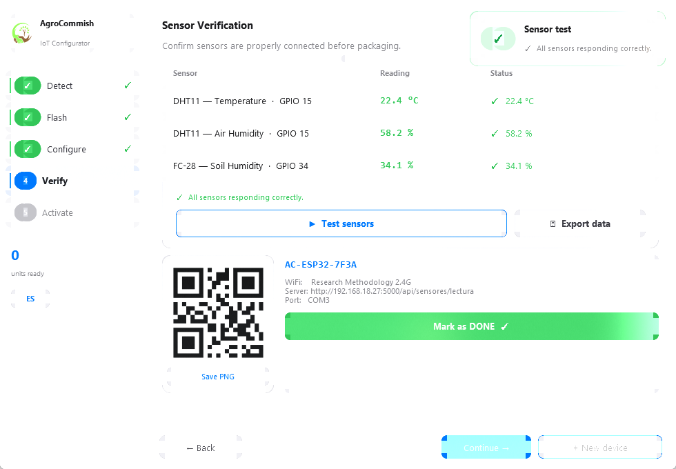

# AgroCommish

[](https://github.com/Andre031222/agrocommish/actions/workflows/ci.yml)
[](LICENSE)
[](https://www.python.org/)

**AgroCommish** is an open-source desktop tool for end-to-end manufacturing and
commissioning of ESP32-based agricultural IoT sensor nodes (DHT11 + FC-28).
It integrates the complete provisioning pipeline into a single five-step
wizard, so a technician without software expertise can take a bare ESP32 board
to a fully deployed, verified, cloud-registered sensor node in minutes.



## Features

- **Step 1 — Detect.** Automatic USB/COM port discovery with live hotplug
  monitoring; CP210x, CH340/341 and FT232 bridges are identified positively.
- **Step 2 — Flash.** Full-erase firmware flashing via `esptool`
  (`--chip auto`: ESP32, S3, C6, ...), with a phased progress indicator
  (connect / erase / write / verify). After reboot, the tool automatically
  **discovers the GPIO pins where the sensors are physically wired** (DHT11
  protocol probing across 17 digital GPIOs; FC-28 signal heuristics across the
  six ADC1 channels) and persists the pin map to the device NVS.
- **Step 3 — Configure.** WiFi and ingestion-endpoint provisioning over a
  newline-framed JSON serial protocol, with on-device network scanning (RSSI),
  pre-flight server reachability diagnostics, and optional sensor calibration
  (offsets and soil ADC dry/wet bounds) written to NVS without recompiling.
- **Step 4 — Verify.** Automatic sensor verification across three acquisition
  channels (JSON command → passive USB telemetry listening → ingestion API
  polling), validated against physical and agronomic ranges in a colour-coded
  table. QR label generation from the eFuse-derived device ID, and one-click
  telemetry export to CSV.
- **Step 5 — Activate.** JWT-based auto-login into the TerraSense web
  platform; the browser opens with the session already active.
- Bilingual UI (English/Spanish) switchable at runtime; commissioning audit
  logs with per-milestone timestamps; SweetAlert-style toast notifications.

## Quick start (Windows binary)

Download `AgroCommish.exe` and `firmware.bin` from the
[latest release](https://github.com/Andre031222/agrocommish/releases), place
them as:

```text
AgroCommish.exe
firmware/firmware.bin
```

and run the executable. No installation or Python environment required.

## Running from source

```bash
git clone https://github.com/Andre031222/agrocommish.git
cd agrocommish
pip install -r requirements.txt
python app.py
```

Requires Python ≥ 3.9. Tested on Windows 10/11; the core modules are
platform-independent (Linux/macOS supported from source).

## Firmware

The companion ESP32 firmware (Arduino) implements the JSON serial protocol
(`identify`, `scan`, `config`, `calibrate`, `read_sensors`, `detect_pins`,
`set_pins`), a captive-portal fallback, NVS persistence, and periodic HTTP
telemetry. Build instructions are in
[`firmware/INSTRUCCIONES.txt`](firmware/INSTRUCCIONES.txt); a precompiled
`firmware.bin` ships with each release.

## Building the executable

```bat
build.bat
```

Produces a standalone `dist/AgroCommish.exe` via PyInstaller
(`AgroCommish.spec` is the versioned build definition).

## Companion tools

| Tool | Purpose |
| ---- | ------- |
| `tools/capturar_datos.py` | Record live USB telemetry (calibrated + raw ADC + HTTP status) to CSV: `python tools/capturar_datos.py COM5 300 out.csv` |
| `tools/medir_tiempos.py` | Per-unit commissioning-time statistics from the session audit logs |
| `tools/take_screenshots_win.py` | Reproducible UI captures for documentation |

## Tests

```bash
pip install pytest
python -m pytest tests/ -v
```

## Project layout

```text
app.py                 # GUI (five-step wizard)
core/
  detector.py          # USB/COM enumeration and ESP32 identification
  flasher.py           # esptool subprocess driver
  provisioner.py       # JSON-over-serial protocol + telemetry capture
  config_manager.py    # Session persistence
  qr_generator.py      # QR label generation
  lang.py              # EN/ES runtime i18n
firmware/              # ESP32 firmware build instructions
tools/                 # CLI utilities
tests/                 # Unit tests (pytest)
```

## License

[MIT](LICENSE)

## Documentation in Spanish

See [`docs/README.es.md`](docs/README.es.md).
